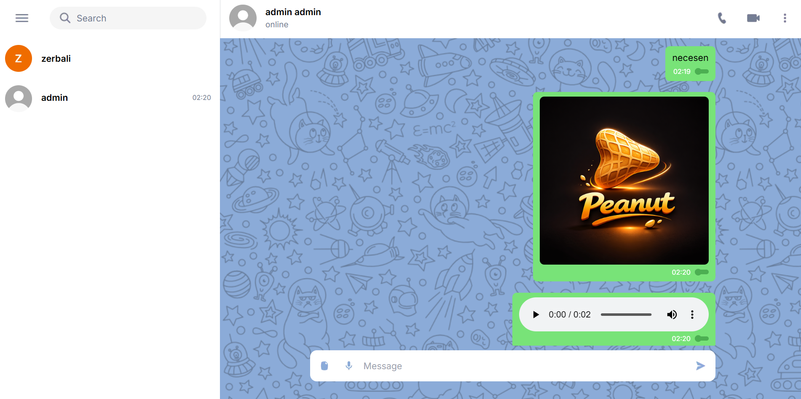
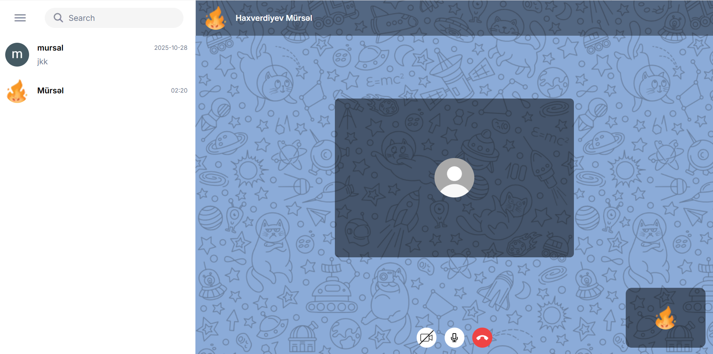

# FastChat

#### FastChat is a modern web application that allows users to communicate instantly through chat, voice messages, video calls, and file sharing. It is built with Next.js, Tailwind CSS, and WebSocket.

#### Use this link to visit the website: [https://p01--fastchat--rzfhl9slfmjn.code.run](https://p01--fastchat--rzfhl9slfmjn.code.run)

## Features

- Real-time messaging using WebSocket
- User-friendly interface
- Voice & video calls
- File sharing capabilities
- Voice messages
- Fast and responsive UI

